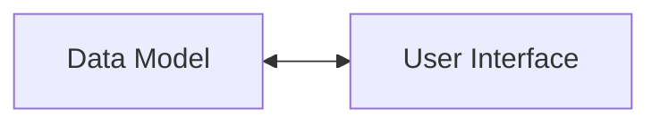
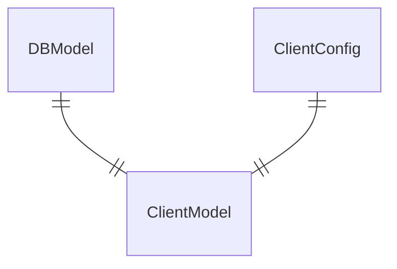
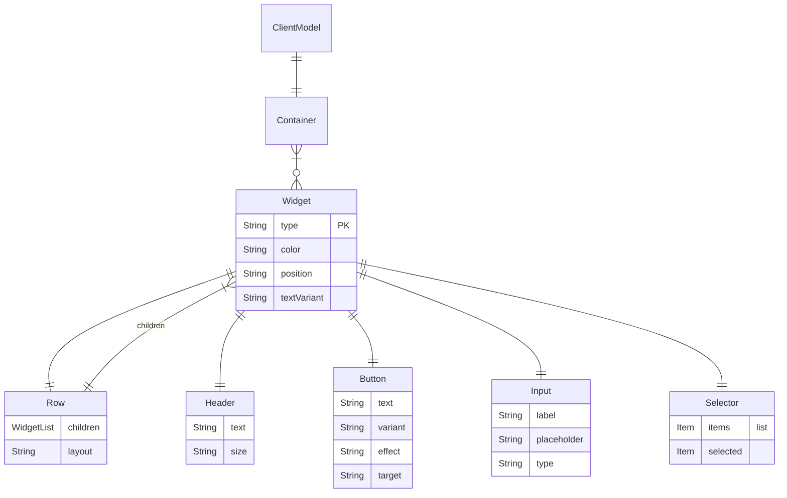

# How does the Anthroware's framework works

-   [Components](components.md)
-   [Screens](screens.md)
-   [Layouts](layouts.md)
-   [Composers](composers.md)
-   [Context Parser](context-parser.md)
-   [Selector](selector.md)
-   [Screen Selector](screen-selector.md)

## Overview

## Data Model

## User Interface

